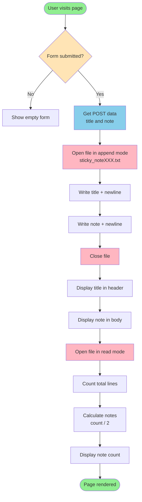
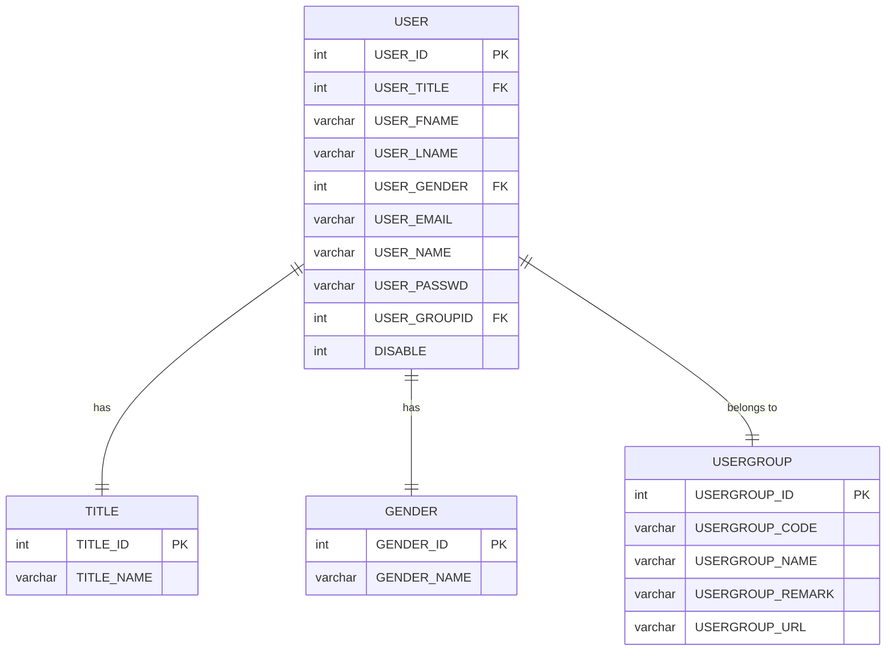
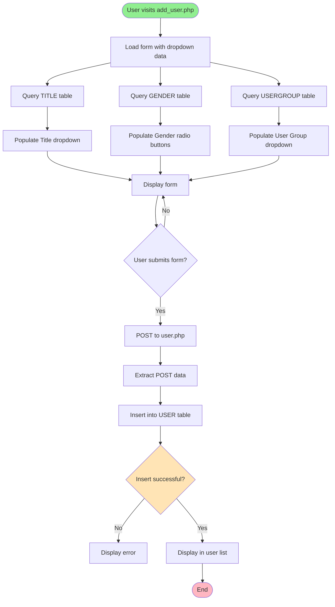
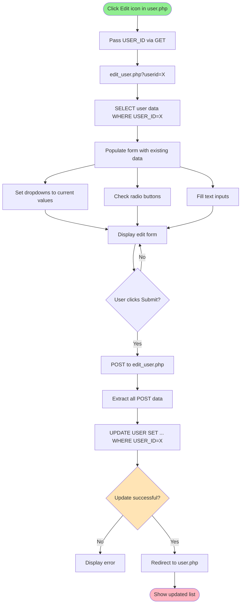
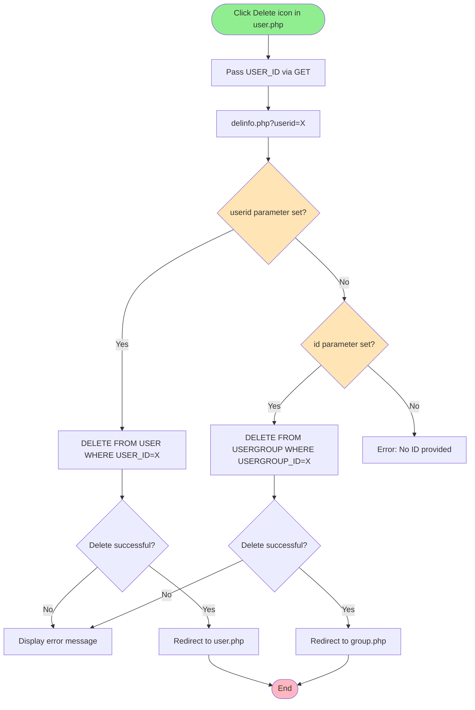

# Lab 12 Assignment Guide


---

## Assignment 12.1 Overview

Create a **Sticky Note Web Application** that allows users to:
1. Enter a title and note content
2. Save notes to a text file
3. Display the most recent note
4. Count and display total number of notes saved

---

## Expected Output

### Visual Result (Figure 1)

```
Title: [___________________________]

Note:  [___________________________]
       [___________________________]
       [___________________________]
       
       [Post!]
       
═══════════════════════════════════

┌──────────────────────────────────┐
│     Hello My Sticky Note         │  ← Title (blue header)
├──────────────────────────────────┤
│ Don't forget to practice and     │  ← Note content
│ submit your assignment!          │  (light blue body)
├──────────────────────────────────┤
│     3 notes have been made       │  ← Footer (blue)
└──────────────────────────────────┘
```

### File Structure (Figure 2)

**sticky_noteXXX.txt** content:
```
hello
test
yeah yeah
note
Hello My Sticky Note
Don't forget to practice and submit your assignment!
```

**Format explanation:**
- Line 1: First note's title
- Line 2: First note's content
- Line 3: Second note's title
- Line 4: Second note's content
- Line 5: Third note's title
- Line 6: Third note's content

---

## Required Files

### 1. **sticky.php** (Main application file)
- Contains HTML form
- Handles POST data
- Reads/writes to text file
- Displays notes

### 2. **sticky.css** (Styling - Already provided)
- Styles the sticky note appearance
- Blue headers and footers
- Light blue note body
- Rounded corners

### 3. **sticky_noteXXX.txt** (Data storage)
- Replace `XXX` with **last 3 digits of your student ID**
- Example: If ID is 6622772422, use `sticky_note422.txt`
- Created automatically by the PHP script

---

## Implementation Steps

### Step 1: Understand the Form Structure

The form is already provided:
```php
<form action="<?= $_SERVER["PHP_SELF"]?>" method="POST">
    <b>Title</b>: <input type="text" name="title" id="title" size="30" > <br><br>
    <b>Note</b>: <textarea name="note" cols="30" rows="5" ></textarea> <br>
    <input type="submit" value="Post!" name="submit" >
</form>
```

**Key points:**
- `action="<?= $_SERVER["PHP_SELF"]?>"` - Submits to same page
- `method="POST"` - Data sent via POST
- Form fields: `title` and `note`
- Submit button named: `submit`

---

### Step 2: Write Data to File (Top of Display Section)

**Location:** Right after the `<hr>` tag, before the `<div class="post">`

```php
<?php
// Check if form was submitted
if(isset($_POST['submit'])) {
    // Get the title and note from POST
    $title = $_POST['title'];
    $note = $_POST['note'];
    
    // Open file in append mode (creates file if it doesn't exist)
    // IMPORTANT: Replace XXX with last 3 digits of your student ID
    $file = fopen("sticky_noteXXX.txt", "a");
    
    // Write title and note to file (each on separate line)
    fwrite($file, $title."\n");
    fwrite($file, $note."\n");
    
    // Close the file
    fclose($file);
}
?>
```

**Explanation:**
- `isset($_POST['submit'])` - Checks if form was submitted
- `fopen("sticky_noteXXX.txt", "a")` - Opens file in append mode
  - `"a"` mode: Append to end of file, create if doesn't exist
- `fwrite($file, $title."\n")` - Writes title with newline
- `\n` - Newline character to separate entries
- `fclose($file)` - Always close files after use

---

### Step 3: Display the Title

**Location:** Inside `<div class="title">` section

```php
<?php
// Only execute after submit (check if submit is set in $_POST)
if(isset($_POST['submit'])) {
    // Echo out the title from POST
    echo $_POST['title'];
}
?>
```

**Explanation:**
- Only displays title when form is submitted
- Uses `echo` to output the title
- CSS class "title" applies blue background styling

---

### Step 4: Display the Note Content

**Location:** Inside `<div class="note">` section

```php
<?php
// Only execute after submit (check if submit is set in $_POST)
if(isset($_POST['submit'])) {
    // Echo out the note from POST
    echo $_POST['note'];
}
?>
```

**Explanation:**
- Displays note content after submission
- CSS class "note" applies light blue background
- Max height of 200px with scroll if needed (defined in CSS)

---

### Step 5: Count and Display Total Notes

**Location:** Inside `<div class="notefoot">` section

```php
<?php
// Only execute after submit (check if submit is set in $_POST)
if(isset($_POST['submit'])) {
    // Open the file to count total number of notes
    // IMPORTANT: Replace XXX with last 3 digits of your student ID
    $file = fopen("sticky_noteXXX.txt", "r");
    $count = 0;
    
    // Count lines in file (every 2 lines = 1 note: title + content)
    while(!feof($file)) {
        $line = fgets($file);
        if($line !== false && trim($line) !== '') {
            $count++;
        }
    }
    fclose($file);
    
    // Calculate number of notes (divide by 2 since each note has title + content)
    $notes = $count / 2;
    
    // Output: "X notes have been made"
    echo "$notes notes have been made";
}
?>
```

**Explanation:**
- `fopen(..., "r")` - Opens file in read mode
- `while(!feof($file))` - Loop until end of file
- `fgets($file)` - Reads one line at a time
- `trim($line) !== ''` - Checks for non-empty lines
- `$count / 2` - Divides by 2 because each note = 2 lines (title + content)
- `echo "$notes notes have been made"` - Displays count

---

## Complete Code Flow Diagram



---

## CSS Explanation (Already Provided)

### Sticky Note Structure

```css
div.post {
    width: 250px;        /* Fixed width */
    margin: 10px;        /* Spacing around note */
    float: left;         /* Allow multiple notes side by side */
}
```

### Title Section (Blue Header)
```css
.post .title {
    font-weight: bold;
    border-top-right-radius: 10px;
    border-top-left-radius: 10px;
    background-color: #2991F9;    /* Blue */
    color: white;
    padding: 0.3em;
    text-align: center;
}
```

### Note Content (Light Blue Body)
```css
.post .note {
    padding: 0.5em;
    overflow: auto;                     /* Scroll if needed */
    margin: 0 10px;
    border-left: 1px dotted black;
    border-right: 1px dotted black;
    max-height: 200px;                  /* Maximum height */
    background-color: #E2F0FE;          /* Light blue */
}
```

### Footer Section (Blue)
```css
.post .notefoot {
    font-weight: bold;
    border-bottom-right-radius: 10px;
    border-bottom-left-radius: 10px;
    background-color: #2991F9;    /* Blue */
    color: white;
    padding: 0.5em;
    text-align: center;
}
```

---

## Testing Checklist

### Test 1: First Note
1. Open `sticky.php` in browser
2. Enter title: "hello"
3. Enter note: "test"
4. Click "Post!"
5. **Expected:** 
   - Title displays "hello"
   - Note displays "test"
   - Footer shows "1 notes have been made"
   - File `sticky_noteXXX.txt` created with 2 lines

### Test 2: Second Note
1. Enter title: "yeah yeah"
2. Enter note: "note"
3. Click "Post!"
4. **Expected:**
   - Title displays "yeah yeah"
   - Note displays "note"
   - Footer shows "2 notes have been made"
   - File now has 4 lines

### Test 3: Third Note (As shown in assignment)
1. Enter title: "Hello My Sticky Note"
2. Enter note: "Don't forget to practice and submit your assignment!"
3. Click "Post!"
4. **Expected:**
   - Title displays "Hello My Sticky Note"
   - Note displays "Don't forget to practice and submit your assignment!"
   - Footer shows "3 notes have been made"
   - File now has 6 lines

### Test 4: Verify File Contents
Open `sticky_noteXXX.txt` in text editor:
```
hello
test
yeah yeah
note
Hello My Sticky Note
Don't forget to practice and submit your assignment!
```

---

## Security Notes for Assignment 12.1

### Current Implementation (Assignment Requirements)
The provided solution works for the assignment but has security considerations:

```php
// Assignment version (works but not production-ready)
$title = $_POST['title'];
$note = $_POST['note'];
```

### Production-Ready Version (For Real Applications)
```php
// Sanitize input
$title = htmlspecialchars($_POST['title'], ENT_QUOTES, 'UTF-8');
$note = htmlspecialchars($_POST['note'], ENT_QUOTES, 'UTF-8');

// Or trim whitespace
$title = trim($_POST['title']);
$note = trim($_POST['note']);

// Validate not empty
if(empty($title) || empty($note)) {
    echo "Please fill in both title and note!";
    exit;
}
```

**Why this matters:**
- Prevents XSS (Cross-Site Scripting) attacks
- Removes unwanted whitespace
- Validates user input

**For this assignment:** Basic version is acceptable, but good to know for future!

---

## PHP Functions Reference

### File Operations
| Function | Purpose | Example |
|----------|---------|---------|
| `fopen($filename, $mode)` | Opens a file | `fopen("data.txt", "a")` |
| `fwrite($file, $string)` | Writes to file | `fwrite($f, "Hello\n")` |
| `fgets($file)` | Reads one line | `$line = fgets($f)` |
| `feof($file)` | Checks if end of file | `while(!feof($f))` |
| `fclose($file)` | Closes file | `fclose($f)` |

### File Modes
| Mode | Description | Creates if Missing |
|------|-------------|-------------------|
| `"r"` | Read only | No (error if missing) |
| `"w"` | Write only (erases existing) | Yes |
| `"a"` | Append (add to end) | Yes |
| `"r+"` | Read and write | No |
| `"w+"` | Read and write (erases) | Yes |
| `"a+"` | Read and append | Yes |

### String Functions
| Function | Purpose | Example |
|----------|---------|---------|
| `trim($string)` | Remove whitespace | `trim(" hi ")` → `"hi"` |
| `strlen($string)` | Get string length | `strlen("hello")` → `5` |
| `substr($string, $start, $len)` | Extract part | `substr("hello", 1, 3)` → `"ell"` |

### Superglobals
| Variable | Contains |
|----------|----------|
| `$_POST` | Form data sent via POST method |
| `$_GET` | URL parameters |
| `$_SERVER` | Server information |


---

# Assignment 12.2: Web Application for User Management System

**Objective:** Apply PHP and DBMS knowledge with HTML/CSS to create a complete CRUD application  
**Score:** 8 marks  
**Submission:** Compress all files into `Assignment12_XXX.zip` (replace XXX with last 3 digits of student ID)

---

## Assignment 12.2 Overview

Create a **User Management System** with the following features:
1. Database with 4 tables (USER, USERGROUP, TITLE, GENDER)
2. Add new user groups
3. Add new users
4. View all users and groups
5. Edit existing users and groups
6. Delete users and groups
7. Proper relationships with foreign key constraints

---

## Database Structure

### Database: `staff`

### Tables Overview



---

## Step-by-Step Implementation

### Step 1: Create Database and Tables

#### USERGROUP Table

```sql
CREATE TABLE USERGROUP (
    USERGROUP_ID INT(11) NOT NULL AUTO_INCREMENT,
    USERGROUP_CODE VARCHAR(50) NOT NULL,
    USERGROUP_NAME VARCHAR(50) NOT NULL,
    USERGROUP_REMARK VARCHAR(255),
    USERGROUP_URL VARCHAR(50),
    PRIMARY KEY (USERGROUP_ID)
) ENGINE=InnoDB DEFAULT CHARSET=utf8mb4;
```

#### USER Table

```sql
CREATE TABLE USER (
    USER_ID INT(11) NOT NULL AUTO_INCREMENT,
    USER_TITLE INT(11) NOT NULL,
    USER_FNAME VARCHAR(50) NOT NULL,
    USER_LNAME VARCHAR(50) NOT NULL,
    USER_GENDER INT(11) NOT NULL,
    USER_EMAIL VARCHAR(50) NOT NULL,
    USER_NAME VARCHAR(25) NOT NULL,
    USER_PASSWD VARCHAR(25) NOT NULL,
    USER_GROUPID INT(11) NOT NULL,
    DISABLE INT(11) DEFAULT 0,
    PRIMARY KEY (USER_ID)
) ENGINE=InnoDB DEFAULT CHARSET=utf8mb4;
```

---

### Step 2: Create TITLE and GENDER Tables

#### TITLE Table with Data

```sql
CREATE TABLE TITLE (
    TITLE_ID INT(11) NOT NULL AUTO_INCREMENT,
    TITLE_NAME VARCHAR(25) NOT NULL,
    PRIMARY KEY (TITLE_ID)
) ENGINE=InnoDB DEFAULT CHARSET=utf8mb4;

-- Insert data
INSERT INTO TITLE (TITLE_ID, TITLE_NAME) VALUES
(1, 'Mr'),
(2, 'Mrs'),
(3, 'Ms'),
(4, 'Dr'),
(5, 'Prof');
```

**Result:**
| TITLE_ID | TITLE_NAME |
|----------|------------|
| 1 | Mr |
| 2 | Mrs |
| 3 | Ms |
| 4 | Dr |
| 5 | Prof |

#### GENDER Table with Data

```sql
CREATE TABLE GENDER (
    GENDER_ID INT(11) NOT NULL AUTO_INCREMENT,
    GENDER_NAME VARCHAR(25) NOT NULL,
    PRIMARY KEY (GENDER_ID)
) ENGINE=InnoDB DEFAULT CHARSET=utf8mb4;

-- Insert data
INSERT INTO GENDER (GENDER_ID, GENDER_NAME) VALUES
(1, 'Male'),
(2, 'Female'),
(3, 'N/A');
```

**Result:**
| GENDER_ID | GENDER_NAME |
|-----------|-------------|
| 1 | Male |
| 2 | Female |
| 3 | N/A |

---

### Step 3: Create Foreign Key Constraints

```sql
-- Add foreign key constraints with RESTRICT
ALTER TABLE USER
ADD CONSTRAINT fk_user_title 
    FOREIGN KEY (USER_TITLE) REFERENCES TITLE(TITLE_ID) 
    ON DELETE RESTRICT ON UPDATE RESTRICT;

ALTER TABLE USER
ADD CONSTRAINT fk_user_gender 
    FOREIGN KEY (USER_GENDER) REFERENCES GENDER(GENDER_ID) 
    ON DELETE RESTRICT ON UPDATE RESTRICT;

ALTER TABLE USER
ADD CONSTRAINT fk_user_group 
    FOREIGN KEY (USER_GROUPID) REFERENCES USERGROUP(USERGROUP_ID) 
    ON DELETE RESTRICT ON UPDATE RESTRICT;
```

**What RESTRICT means:**
- Cannot delete a TITLE if any USER uses it
- Cannot delete a GENDER if any USER uses it
- Cannot delete a USERGROUP if any USER belongs to it
- Prevents orphaned records

---

### Step 4: Complete add_group.php → group.php

#### add_group.php (Already provided)

Form submits to `group.php` with POST method:
- `groupcode` - Group Code
- `groupname` - Group Name
- `remark` - Description
- `url` - URL

#### group.php Implementation

```php
<?php 
if(isset($_POST['submit'])) {
    // Extract data from POST
    $groupcode = $mysqli->real_escape_string($_POST['groupcode']);
    $groupname = $mysqli->real_escape_string($_POST['groupname']);
    $remark = $mysqli->real_escape_string($_POST['remark']);
    $url = $mysqli->real_escape_string($_POST['url']);
    
    // Insert to USERGROUP table
    $q = "INSERT INTO USERGROUP (USERGROUP_CODE, USERGROUP_NAME, USERGROUP_REMARK, USERGROUP_URL) 
          VALUES ('$groupcode', '$groupname', '$remark', '$url')";
    
    $result = $mysqli->query($q);
    if(!$result){
        echo "Insert failed. Error: ".$mysqli->error;
    }
}
?>
```

#### Display groups in table

```php
<?php
$q = "SELECT * FROM USERGROUP";
$result = $mysqli->query($q);
if(!$result){
    echo "Select failed. Error: ".$mysqli->error;
    return false;
}
while($row = $result->fetch_array()){ ?>
<tr>
    <td><?php echo $row['USERGROUP_CODE']; ?></td> 
    <td><?php echo $row['USERGROUP_NAME']; ?></td>
    <td><?php echo $row['USERGROUP_REMARK']; ?></td>
    <td><?php echo $row['USERGROUP_URL']; ?></td>
    <td><a href='edit_group.php?id=<?=$row['USERGROUP_ID']?>'>
        </a></td>
    <td><a href='delinfo.php?id=<?=$row['USERGROUP_ID']?>'> 
        </a></td>
</tr>
<?php } ?>
```

#### Count total records

```php
<?php 
$q = "SELECT COUNT(*) as total FROM USERGROUP";
$result = $mysqli->query($q);
if($result){
    $row = $result->fetch_array();
    echo "<tr><td colspan='6' style='text-align:right;'>Total ".$row['total']." records</td></tr>";
}
?>
```

---

### Step 5: Complete add_user.php → user.php

#### add_user.php - Populate Dropdowns and Radio Buttons

**Title Dropdown:**
```php
<label>Title</label>
<select name="title">
<?php
$q = 'SELECT TITLE_ID, TITLE_NAME FROM TITLE;';
if($result = $mysqli->query($q)){
    while($row = $result->fetch_array()){
        echo '<option value="'.$row[0].'">'.$row[1].'</option>';
    }
} else {
    echo 'Query error: '.$mysqli->error;
}
?>
</select>
```

**Gender Radio Buttons:**
```php
<label>Gender</label>
<?php
$q = 'SELECT GENDER_ID, GENDER_NAME FROM GENDER;';
if($result = $mysqli->query($q)){
    while($row = $result->fetch_array()){
        echo '<input type="radio" name="gender" value="'.$row[0].'">'.$row[1];
    }
} else {
    echo 'Query error: '.$mysqli->error;
}
?>
```

**User Group Dropdown:**
```php
<label>User group</label>
<select name="usergroup">
<?php
$q = 'SELECT USERGROUP_ID, USERGROUP_NAME FROM USERGROUP;';
if($result = $mysqli->query($q)){
    while($row = $result->fetch_array()){
        echo '<option value="'.$row[0].'">'.$row[1].'</option>';
    }
} else {
    echo 'Query error: '.$mysqli->error;
}
?>
</select>
```

#### user.php - Insert Data

```php
<?php
if(isset($_POST['sub'])) {
    // Extract data from POST
    $title = $_POST['title'];
    $firstname = $mysqli->real_escape_string($_POST['firstname']);
    $lastname = $mysqli->real_escape_string($_POST['lastname']);
    $gender = $_POST['gender'];
    $email = $mysqli->real_escape_string($_POST['email']);
    $username = $mysqli->real_escape_string($_POST['username']);
    $passwd = $mysqli->real_escape_string($_POST['passwd']);
    $usergroup = $_POST['usergroup'];
    
    // Check if disabled checkbox is set
    if(isset($_POST['disabled'])) {
        $disabled = $_POST['disabled'];
    } else {
        $disabled = 0;
    }
    
    // Insert into USER table
    $q = "INSERT INTO USER (USER_TITLE, USER_FNAME, USER_LNAME, USER_GENDER, USER_EMAIL, USER_NAME, USER_PASSWD, USER_GROUPID, DISABLE) 
          VALUES ('$title', '$firstname', '$lastname', '$gender', '$email', '$username', '$passwd', '$usergroup', '$disabled')";
    
    $result = $mysqli->query($q);
    if(!$result){
        echo "Insert failed. Error: ".$mysqli->error;
    }
}
?>
```

#### Display users with JOIN query

```php
<?php
$q = "SELECT * FROM USER, USERGROUP, TITLE, GENDER 
      WHERE USER.USER_GROUPID = USERGROUP.USERGROUP_ID 
      AND USER.USER_TITLE = TITLE.TITLE_ID 
      AND GENDER.GENDER_ID = USER.USER_GENDER";
$result = $mysqli->query($q);
if(!$result){
    echo "Select failed. Error: ".$mysqli->error;
}
while($row = $result->fetch_array()){ ?>
<tr>
    <td><?php echo $row['TITLE_NAME']; ?></td> 
    <td><?php echo $row['USER_FNAME']; ?> <?php echo $row['USER_LNAME']; ?> (<?php echo $row['GENDER_NAME']; ?>)</td>
    <td><?php echo $row['USER_EMAIL']; ?></td>
    <td><?php echo $row['USERGROUP_NAME']; ?></td>
    <td><input type='checkbox' <?php if($row['DISABLE']) echo "CHECKED"; echo " disabled"; ?>></td>
    <td><a href='edit_user.php?userid=<?=$row['USER_ID']?>'>
        </a></td>
    <td><a href='delinfo.php?userid=<?=$row['USER_ID']?>'> 
        </a></td>
</tr>
<?php } ?>
```

---

### Step 6: Implement Delete Functionality

#### delinfo.php (Already provided)

**For User Deletion:**
```php
if(isset($userid)) {
    $q = "DELETE FROM USER WHERE USER_ID=$userid";
    if(!$mysqli->query($q)){
        echo "DELETE failed. Error: ".$mysqli->error;
    }
    $mysqli->close();
    header("Location: user.php");
}
```

**For Group Deletion:**
```php
if(isset($id)) {
    $q = "DELETE FROM USERGROUP WHERE USERGROUP_ID=$id";
    if(!$mysqli->query($q)){
        echo "DELETE failed. Error: ".$mysqli->error;
    }
    $mysqli->close();
    header("Location: group.php");
}
```

#### Link delete icon in user.php

```php
<td><a href='delinfo.php?userid=<?=$row['USER_ID']?>'> 
    </a></td>
```

**URL example:** `http://localhost/delinfo.php?userid=3`

#### Link delete icon in group.php

```php
<td><a href='delinfo.php?id=<?=$row['USERGROUP_ID']?>'> 
    </a></td>
```

---

### Step 7: Delete Groups (Same as Step 6)

Already covered in Step 6 - the same `delinfo.php` handles both user and group deletion using different parameters.

---

### Step 8: Implement Edit Functionality

#### edit_user.php

**Step 1: Get user data**
```php
<?php
$userid = $_GET['userid'];
$q = "SELECT * FROM USER WHERE USER_ID = $userid";
$result = $mysqli->query($q);
```

**Step 2: Populate form with existing data**
```php
while($row = $result->fetch_array()) {
    // Title dropdown with selected value
    echo "<select name='title'>";
    $q1 = "SELECT TITLE_ID, TITLE_NAME FROM TITLE";
    if($result1 = $mysqli->query($q1)) {
        while($row1 = $result1->fetch_array()) {
            echo "<option value='$row1[0]' ";
            if($row1[0] == $row['USER_TITLE'])
                echo "SELECTED";
            echo ">$row1[1]</option>";
        }
    }
    echo "</select>";
    
    // Text inputs with values
    echo "<input type='text' name='firstname' value='".$row['USER_FNAME']."'>";
    echo "<input type='text' name='lastname' value='".$row['USER_LNAME']."'>";
    
    // Gender radio with checked
    $q2 = 'SELECT GENDER_ID, GENDER_NAME FROM GENDER;';
    if($result2 = $mysqli->query($q2)) {
        while($row2 = $result2->fetch_array()) {
            echo "<input ";
            if($row2[0] == $row['USER_GENDER'])
                echo "CHECKED='CHECKED' ";
            echo "type='radio' name='gender' value='$row2[0]'>".$row2[1];
        }
    }
    
    // Hidden field for user ID
    echo "<input type='hidden' name='userid' value='".$row['USER_ID']."'>";
}
```

**Step 3: Handle update**
```php
<?php
if(isset($_POST['sub'])) {
    // Extract all data
    $userid = $_POST['userid'];
    $title = $_POST['title'];
    $firstname = $mysqli->real_escape_string($_POST['firstname']);
    $lastname = $mysqli->real_escape_string($_POST['lastname']);
    $gender = $_POST['gender'];
    $email = $mysqli->real_escape_string($_POST['email']);
    $username = $mysqli->real_escape_string($_POST['username']);
    $passwd = $mysqli->real_escape_string($_POST['passwd']);
    $usergroup = $_POST['usergroup'];
    
    if(isset($_POST['disabled'])) {
        $disabled = 1;
    } else {
        $disabled = 0;
    }

    $q = "UPDATE USER SET USER_TITLE='$title', USER_FNAME='$firstname', USER_LNAME='$lastname', 
          USER_GENDER='$gender', USER_EMAIL='$email', USER_NAME='$username', USER_PASSWD='$passwd', 
          USER_GROUPID='$usergroup', DISABLE='$disabled' WHERE USER_ID='$userid'";

    $result = $mysqli->query($q);
    if(!$result) {
        echo "Update failed. Error: ".$mysqli->error;
    }
    header("Location: user.php");
}
?>
```

#### edit_group.php

**Get group data and populate:**
```php
<?php
$uid = $_GET['id'];
$q = "SELECT * FROM USERGROUP WHERE USERGROUP_ID=$uid";
$result = $mysqli->query($q);

while($row = $result->fetch_array()) {
    echo "<input type='text' name='groupcode' value='".$row['USERGROUP_CODE']."'>";
    echo "<input type='text' name='groupname' value='".$row['USERGROUP_NAME']."'>";
    echo "<textarea name='remark'>".$row['USERGROUP_REMARK']."</textarea>";
    echo "<input type='text' name='groupurl' value='".$row['USERGROUP_URL']."'>";
    echo "<input type='hidden' name='uid' value='".$row['USERGROUP_ID']."'>";
}
?>
```

**Handle update:**
```php
<?php
if(isset($_POST['su'])) {
    $uid = $_POST['uid'];
    $groupcode = $mysqli->real_escape_string($_POST['groupcode']);
    $groupname = $mysqli->real_escape_string($_POST['groupname']);
    $remark = $mysqli->real_escape_string($_POST['remark']);
    $groupurl = $mysqli->real_escape_string($_POST['groupurl']);
    
    $q = "UPDATE USERGROUP SET USERGROUP_CODE='$groupcode', USERGROUP_NAME='$groupname', 
          USERGROUP_REMARK='$remark', USERGROUP_URL='$groupurl' WHERE USERGROUP_ID='$uid'";
    
    $result = $mysqli->query($q);
    if(!$result){
        echo "Update failed. Error: ".$mysqli->error;
    }
    header("Location: group.php");
}
?>
```

---

## Application Flow Diagrams

### Add User Flow



### Edit User Flow



### Delete User Flow



---

## Complete File Structure

```
Assignment12_XXX/
├── staff_database.sql         # Database structure and data
├── connect.php                # Database connection
├── header.php                 # Navigation menu
├── default.css                # Styling
├── add_group.php             # Add new user group form
├── group.php                 # Display all groups + insert handler
├── edit_group.php            # Edit group form + update handler
├── add_user.php              # Add new user form
├── user.php                  # Display all users + insert handler
├── edit_user.php             # Edit user form + update handler
├── delinfo.php               # Delete handler (users & groups)
└── images/
    ├── Modify.png            # Edit icon (24x24)
    └── Delete.png            # Delete icon (24x24)
```

---

## CSS Highlights (default.css)

### Pink Theme Colors
- Primary: `#F577A6` (pink header)
- Secondary: `#F5E1E9` (light pink sidebar)
- Accent: `#F5C8DA` (dotted borders)

### Key Styles
```css
/* Table styling */
.usergroup th {
    border: 1px solid black;
    background-color: #F577A6;
}

/* Form labels - right-aligned */
.form label {
    display: block;
    text-align: right;
    font-weight: bold;
    width: 200px;
    float: left;
}

/* Navigation menu */
#menu a:hover {
    text-decoration: underline;
    background-color: #DE4B82;
}
```

---

## Security Notes for Assignment 12.2

### Current Implementation (Acceptable for Assignment)
```php
// Basic escaping
$firstname = $mysqli->real_escape_string($_POST['firstname']);
```

### Production-Level Security (Beyond Assignment)
```php
// Prepared statements (more secure)
$stmt = $mysqli->prepare("INSERT INTO USER (USER_FNAME, USER_LNAME) VALUES (?, ?)");
$stmt->bind_param("ss", $firstname, $lastname);
$stmt->execute();

// Password hashing (never store plain text passwords)
$hashed_password = password_hash($_POST['passwd'], PASSWORD_DEFAULT);

// Input validation
if(empty($_POST['firstname']) || empty($_POST['email'])) {
    echo "All fields required!";
    exit();
}

// Email validation
if(!filter_var($_POST['email'], FILTER_VALIDATE_EMAIL)) {
    echo "Invalid email format!";
    exit();
}
```

**For this assignment:** Basic `real_escape_string()` is sufficient, but understanding better practices is valuable!


